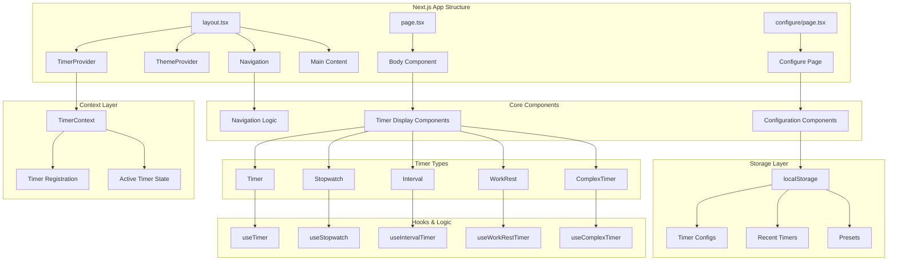
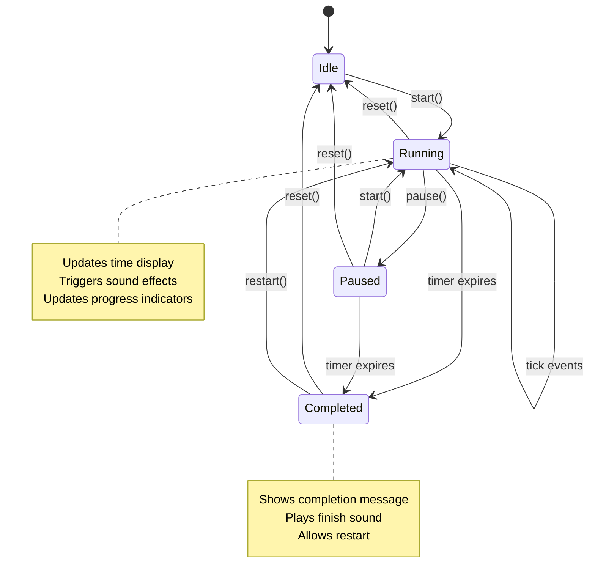
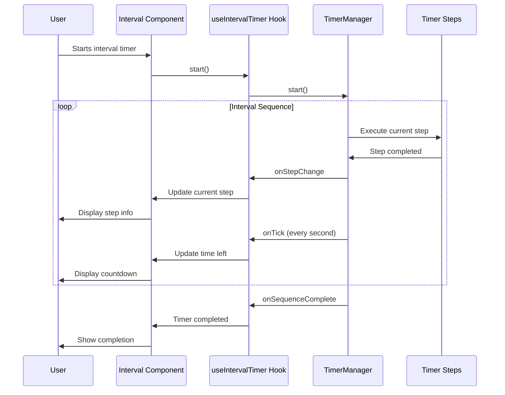
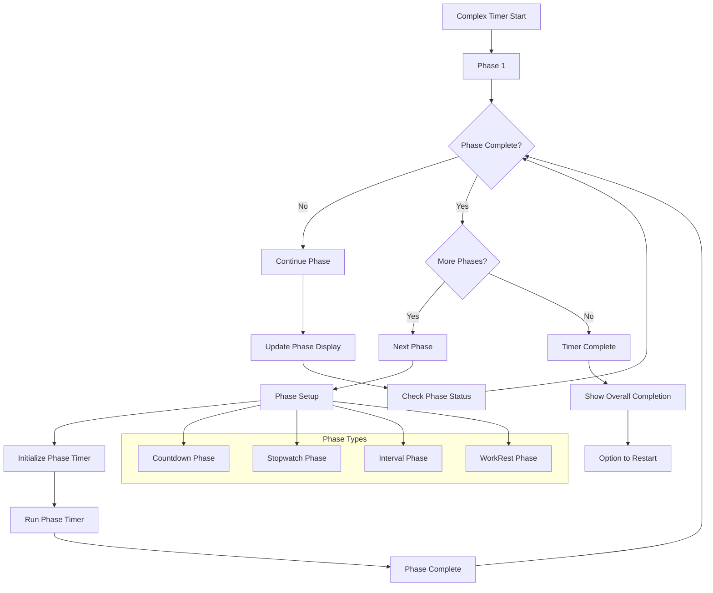
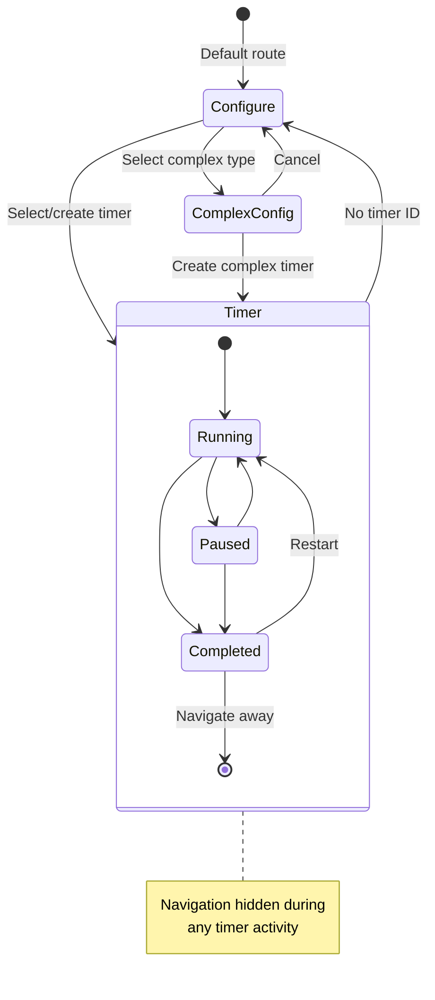
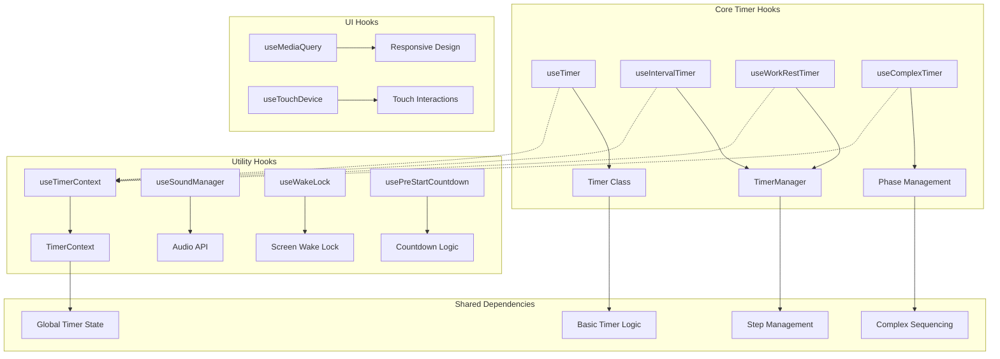
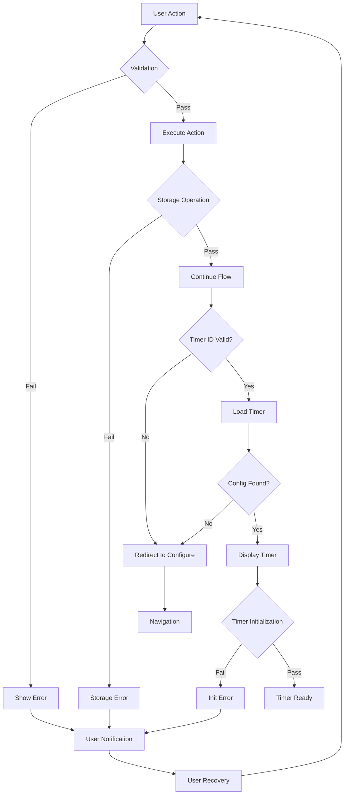

# Timer Application Project Flows

## 1. Application Architecture Overview



## 2. User Flow: Timer Creation and Execution

```mermaid
flowchart TD
    A[User Accesses App] --> B{Has Timer ID?}
    B -->|No| C[Redirect to /configure]
    B -->|Yes| D[Load Timer Config]
    
    C --> E[Configure Page]
    E --> F{Select Timer Type}
    F -->|Countdown| G[Countdown Config]
    F -->|Stopwatch| H[Stopwatch Config]
    F -->|Interval| I[Interval Config]
    F -->|WorkRest| J[WorkRest Config]
    F -->|Complex| K[Complex Config Page]
    
    G --> L[Configure Settings]
    H --> L
    I --> L
    J --> L
    K --> L
    
    L --> M[Save Configuration]
    M --> N[Generate Timer ID]
    N --> O[Store in localStorage]
    O --> P[Add to Recent Timers]
    P --> Q[Navigate to /?id={timerId}]
    
    D --> R{Config Found?}
    R -->|No| C
    R -->|Yes| S[Display Timer Component]
    
    S --> T[Timer Component Renders]
    T --> U[Initialize Timer Hook]
    U --> V[Register with TimerContext]
    V --> W[Hide Navigation]
    W --> X[User Can Control Timer]
    
    X --> Y[Timer Actions]
    Y --> Z[Start/Pause/Reset]
    Y --> AA[Timer Updates]
    AA --> BB[State Changes]
    BB --> CC[Context Updates]
    CC --> DD[UI Updates]
```

## 3. Timer State Management Flow



## 4. Component Data Flow

```mermaid
graph LR
    subgraph "Configuration Flow"
        A[TimerTypeSelector] --> B[TimerConfigForm]
        B --> C[Form Validation]
        C --> D[Config Object]
        D --> E[Storage Manager]
        E --> F[localStorage]
    end
    
    subgraph "Display Flow"
        G[URL Params] --> H[Body Component]
        H --> I[Storage Lookup]
        I --> J[Timer Config]
        J --> K[Component Router]
        K --> L[Specific Timer Component]
    end
    
    subgraph "Timer Operation Flow"
        L --> M[Timer Hook]
        M --> N[Timer Class/Manager]
        N --> O[State Updates]
        O --> P[Context Updates]
        P --> Q[UI Re-renders]
    end
    
    subgraph "Context Integration"
        R[TimerContext] --> S[Active Timer Tracking]
        S --> T[Navigation Visibility]
        S --> U[Global State]
    end
    
    F -.-> I
    Q -.-> R
```



## 5. Interval Timer Flow



## 6. Storage Management Flow

```mermaid
graph TD
    subgraph "Storage Operations"
        A[Timer Config] --> B[Storage Manager]
        B --> C[localStorage API]
        C --> D[Persisted Data]
    end
    
    subgraph "Data Types"
        E[Recent Timers] --> F[recent_timers key]
        G[Timer Configs] --> H[timer_{id} key]
        I[Presets] --> J[preset_{id} key]
    end
    
    subgraph "Data Flow"
        K[User Action] --> L[Create/Update Timer]
        L --> M[Generate ID]
        M --> N[Store Config]
        N --> O[Update Recent List]
        O --> P[Cleanup Old Timers]
    end
    
    subgraph "Retrieval Flow"
        Q[Page Load] --> R[Get Timer ID]
        R --> S[Lookup Config]
        S --> T[Parse & Validate]
        T --> U[Return Config]
    end
    
    F --> C
    H --> C
    J --> C
    D --> S
```

## 7. Complex Timer Phase Flow



## 8. Navigation and Routing Flow



## 9. Hook Dependencies and Interactions



## 10. Error Handling and Edge Cases



These diagrams provide a comprehensive view of the timer application's architecture, user flows, data management, and component interactions. They can be used for onboarding new developers, understanding the system architecture, and planning future enhancements.
